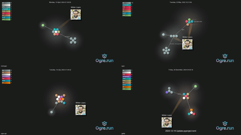

# Repository Visualization with Gource

This repository provides a streamlined way to create captivating videos showcasing the evolution of a Git repository. Using Gource, a software visualization tool, it visually represents the history of code changes, highlighting contributions from different developers over time. Each commit appears as a dynamic event, with files being added, modified, and deleted by user avatars, making the repository's history engaging and easy to understand.  This allows developers and project stakeholders to grasp the development progress and contributions at a glance.

This can be highly valuable for project demonstrations, showcasing open-source contributions, creating engaging overviews of a repository's lifecycle for presentations or reports, and generating visualizations for personal archives.


## Setup and Usage

This script requires `gource`, `ffmpeg`, `xvfb-run` (for headless environments), and `git` to be installed on your system.  You can typically install these through your system's package manager (e.g., `apt-get`, `brew`, `yum`, etc.).

**Debian/Ubuntu:**

```bash
sudo apt-get install gource ffmpeg git xvfb-run
```

**macOS (Homebrew):**

```bash
brew install gource ffmpeg git xvfb-run
```


**To create a visualization video:**

1. **Clone this repository:**

```bash
git clone https://github.com/<your_username>/<this_repo>.git
cd <this_repo>
```

2. **Run the script:** The script takes one argument: either the URL of the Git repository or a path to a local repository.

**Using a Git repository URL:**

```bash
./run.sh <GitHub_repository_URL>
```

**Using a local repository path:**

```bash
./run.sh /path/to/your/local/repository
```


**Example:**

```bash
./run.sh https://github.com/user/repo.git
```

or

```bash
./run.sh /home/user/my-project
```


**The script will:**

1. **Clone the repository (if a URL is provided):**  Skips this step if a local path is provided.
2. **Generate `caption.txt`:** Extracts the commit history with timestamps and messages.
3. **Run Gource:** Generates a stream of PPM image frames visualizing the repository's history based on the `gource.config` settings. Uses `xvfb-run` to avoid display issues on servers.
4. **Run FFmpeg:** Encodes the PPM stream into an MP4 video file named `gource.x264-<repository_name>.mp4`.
5. **Clean up:** Removes the temporary `output.ppm` file.


## Configuration

The `gource.config` file allows customization of the visualization. You can adjust settings like viewport size, display options, user scaling, colors, and the project logo.  Refer to the Gource documentation for a complete list of available options: [https://github.com/acaudwell/Gource](https://github.com/acaudwell/Gource)


## Creating a Video Grid (concatenate)

This repository also includes a script to create a 2x2 video grid from four input videos. This is useful for comparing different repositories' visualizations side-by-side.




**To use the video grid script:**

1. **Navigate to the `concatenate` directory:**

```bash
cd concatenate
```

2. **Ensure you have `ffmpeg` installed.**

3. **Place the four video files you want to combine (e.g., `video1.mp4`, `video2.mp4`, `video3.mp4`, `video4.mp4`) in the `concatenate` directory.** Or modify the `concatenate.sh` script and `mylist.txt` to point to your video files.  A more robust solution is described below.

4. **Run the script:**

```bash
./concatenate.sh
```

This will create a new video file named `output.mp4` containing the 2x2 grid.


**More robust approach to video concatenation:**

For a more flexible approach that avoids manual file renaming, use a file list and the `concat` demuxer in `ffmpeg`.  This repository includes `mylist.txt`, which lists the desired video files.  You can create your own list, ensuring the videos are specified with `file 'path/to/video.mp4'` on separate lines.  Then, use the following `ffmpeg` command:


```bash
ffmpeg -f concat -safe 0 -i mylist.txt -c copy output.mp4
```

This command reads the file list from `mylist.txt`, concatenates the specified videos, and outputs the result to `output.mp4`. The `-safe 0` option is often necessary when dealing with absolute paths.


## Included Files

* **`run.sh`:** The main script to automate the Gource visualization process.
* **`gource.config`:** Configuration file for Gource.
* **`concatenate/concatenate.sh`:** Script to create a 2x2 video grid.
* **`concatenate/mylist.txt`:**  Example file list for video concatenation with `ffmpeg concat`.
