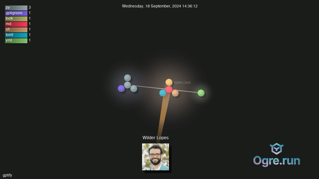

# Repository Visualization with Gource

This repository provides a streamlined way to create captivating videos showcasing the evolution of a Git repository. Using Gource, it visually represents the history of code changes, highlighting contributions from different developers over time. Each commit appears as a dynamic event, with files being added, modified, and deleted by user avatars, making the repository's history engaging and easy to understand.

This is particularly useful for:

* **Project Demonstrations:** Showcasing the development progress of a project in a visually compelling manner.
* **Open Source Contributions:** Highlighting the collaborative efforts within an open-source project.
* **Repository History Visualization:** Creating an engaging overview of a repository's lifecycle, suitable for presentations, reports, or personal archives.



## Setup and Usage

This script requires `gource`, `ffmpeg`, `xvfb-run` and `git` to be installed on your system.  You can usually install these through your system's package manager (e.g., `apt-get`, `brew`, `yum`, etc.). For example, on Debian/Ubuntu:

```bash
sudo apt-get install gource ffmpeg git xvfb-run
```

To create a visualization video, follow these steps:

1. **Clone this repository:**

```bash
git clone https://github.com/<your_username>/<this_repo>.git
cd <this_repo>
```

2. **Run the script:** The script takes one argument: the URL of the GitHub repository.

```bash
./run.sh <GitHub_repository_URL>
```
or
```bash
./run.sh /path/to/your/local/repository
```

For example:

```bash
./run.sh https://github.com/user/repo.git
```

or

```bash
./run.sh /home/user/my-project
```

The script will:

1. **Clone the repository (if a URL is provided):**  If a local path is provided, it skips this step.
2. **Generate `caption.txt`:** Extracts the commit history with timestamps and messages.
3. **Run Gource:** Generates a stream of PPM image frames visualizing the repository's history based on the `gource.config` settings.  It uses `xvfb-run` to execute Gource in a virtual display environment, avoiding potential display issues on servers.
4. **Run FFmpeg:** Encodes the PPM stream into an MP4 video file named `gource.x264-<repository_name>.mp4`.
5. **Clean up:** Removes the temporary `output.ppm` file.


## Configuration

The `gource.config` file allows customization of the visualization. You can adjust settings like viewport size, display options, user scaling, colors, and the project logo.  Refer to the Gource documentation for a complete list of available options: [https://github.com/acaudwell/Gource](https://github.com/acaudwell/Gource)


## Included Files

* **`run.sh`:** The main script to automate the visualization process.
* **`gource.config`:** Configuration file for Gource.
